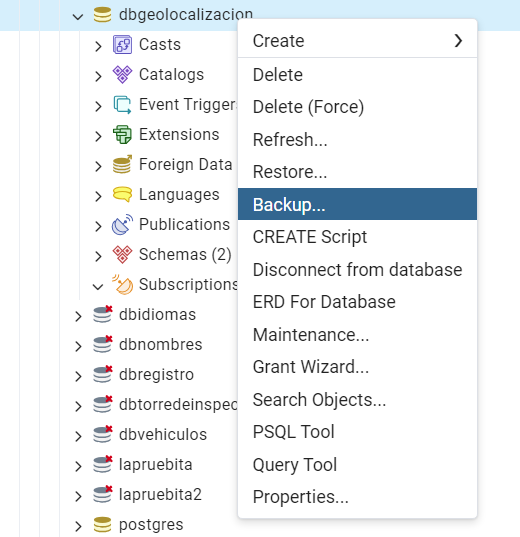
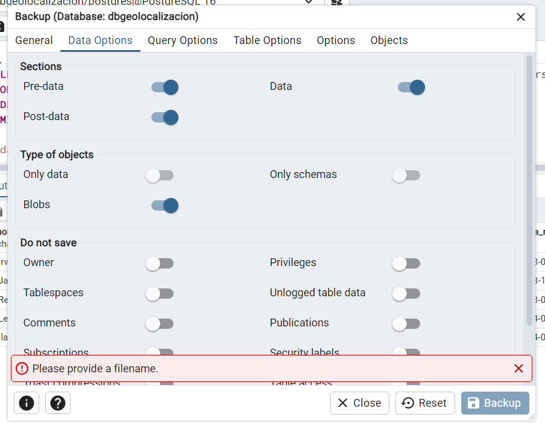

# Postgres
_**PROYECTO GEOLOCALIZACIÓN**_


*Autora: Aura Nicte-Ha Pech Reyes.*

### ARCHIVO DE BACKUP DE LA BASE DE DATOS

 "C:\Users\damfa\Downloads\cursopostgres\bd_geolocalizacion.sql"


 

### DESCRIPCIÓN DE LA BASE DE DATOS

La base de datos del proyecto de Geolocalización surge de la necesidad de dar seguridad al personal de la Guardia Nacional en actividades operativas, el proyecto no previene delitos, sin embargo al tener una herramienta como esta, tendremos un control seguro de que el personal que pueda tener un percance importante, se le pueda brindar ayuda, con ayuda de la base datos, consultar su geolocalización, latitud, longitud, entre otros datos importantes que se almacenarán en las tablas creadas.


# LINEA DE TIEMPO


	1.- 1986: Inicio del proyecto POSTGRES.
    2.- 1996: Renombramiento a PostgreSQL 6.0.
    3.- 2005: Lanzamiento de PostgreSQL 8.0 (soporte nativo para Windows).
    4.- 2010: PostgreSQL 9.0 (replicación streaming, Hot Standby)
    5.- 2016: PostgreSQL 9.6 (mejoras en paralelización de consultas)
    6.- 2020: PostgreSQL 13 (optimización de índices, nuevas características de seguridad)

# DISEÑO DE LA BASE DE DATOS:


*tbl_acceso_usuario:* en esta tabla se almacenan los datos de acceso de las personas que ya se registraron previamente.


*tbl_bitacora_acceso:*  se prevee que en esta tabla se lleve un registro de cuantas veces el usuario accede al aplicativo, hora fecha y que acciones tuvo en el aplicativo.


*tbl_datos_telefono:* en esta tabla se almacenan los datos del telefono del los usuarios que ya se registraron previamente.


*tbl_liga_gps_personas:* en esta tabla se vé el estatus activo e inactivo del usuario.


*tbl_personas:* en esta tabla el usuario registra datos personales.


*tbl_ubicacion_dispositivo:* en esta tabla se almacenan la ubicación exacta del dispositivo.


*cat_area_laboral:* el catálogo se epecifica en que Dirección se encuentran.

# DIAGRAMA ENTIDAD - RELACIÓN 


# GENERACIÓN DE BASE DE DATOS 

GENERACIÓN DE TABLAS EN BASE DE DATOS.

```sql
BEGIN;


CREATE TABLE IF NOT EXISTS ubicacionpersona.cat_area_laboral
(
    direccion_general_inteligencia character varying COLLATE pg_catalog."default" NOT NULL,
    direccion_general_investigacion character varying COLLATE pg_catalog."default" NOT NULL,
    direccion_general_seguridad_carreteras_instalaciones character varying COLLATE pg_catalog."default" NOT NULL,
    direccion_general_cientifica character varying COLLATE pg_catalog."default" NOT NULL,
    direccion_general_antidrogas character varying COLLATE pg_catalog."default" NOT NULL,
    direccion_general_transportes_aereos character varying COLLATE pg_catalog."default" NOT NULL,
    direccion_general_seguridad_procesal character varying COLLATE pg_catalog."default" NOT NULL,
    id_nombre_laboral integer NOT NULL DEFAULT nextval('ubicacionpersona.tbl_area_laboral_id_nombre_laboral_seq'::regclass),
    id_personas integer NOT NULL,
    CONSTRAINT tbl_area_laboral_pkey PRIMARY KEY (id_nombre_laboral)
);

CREATE TABLE IF NOT EXISTS ubicacionpersona.tbl_acceso_usuario
(
    contrasena character varying COLLATE pg_catalog."default" NOT NULL,
    salt character varying COLLATE pg_catalog."default" NOT NULL,
    nombre_usuario character varying COLLATE pg_catalog."default" NOT NULL,
    id_acceso_usuario serial NOT NULL,
    id_persona serial NOT NULL,
    CONSTRAINT id_acceso_usuario PRIMARY KEY (id_acceso_usuario)
);

CREATE TABLE IF NOT EXISTS ubicacionpersona.tbl_bitacora_acceso
(
    id_usuario integer NOT NULL,
    accion character varying COLLATE pg_catalog."default" NOT NULL,
    id_bitacora integer NOT NULL,
    id_accesousu integer NOT NULL,
    id_bitacoraacceso serial NOT NULL,
    id_acceso_usuario integer NOT NULL,
    fecha date NOT NULL,
    hora character varying COLLATE pg_catalog."default" NOT NULL,
    CONSTRAINT tbl_bitacora_acceso_pkey PRIMARY KEY (id_bitacoraacceso)
);

CREATE TABLE IF NOT EXISTS ubicacionpersona.tbl_datos_telefono
(
    marca character varying COLLATE pg_catalog."default" NOT NULL,
    imei character varying COLLATE pg_catalog."default" NOT NULL,
    color character varying COLLATE pg_catalog."default" NOT NULL,
    modelo character varying COLLATE pg_catalog."default" NOT NULL,
    descripcion character varying COLLATE pg_catalog."default" NOT NULL,
    id_datos_telefono serial NOT NULL,
    id_personas integer NOT NULL,
    CONSTRAINT tbl_datos_telefono_pkey PRIMARY KEY (id_datos_telefono)
);

CREATE TABLE IF NOT EXISTS ubicacionpersona.tbl_liga_gps_personas
(
    id_persona_asignada integer NOT NULL,
    id_gps integer NOT NULL,
    id_estatus boolean NOT NULL,
    id_status integer NOT NULL,
    id_ligagpspersona serial NOT NULL,
    id_datos_telefono integer NOT NULL,
    CONSTRAINT tbl_liga_gps_personas_pkey PRIMARY KEY (id_ligagpspersona)
);

CREATE TABLE IF NOT EXISTS ubicacionpersona.tbl_personas
(
    nombre character varying COLLATE pg_catalog."default" NOT NULL,
    apellido_paterno character varying COLLATE pg_catalog."default" NOT NULL,
    apellido_materno character varying COLLATE pg_catalog."default" NOT NULL,
    curp character varying(20) COLLATE pg_catalog."default" NOT NULL,
    rfc character varying(14) COLLATE pg_catalog."default" NOT NULL,
    fecha_nacimiento date NOT NULL,
    id_persona serial NOT NULL,
    numero_celular numeric NOT NULL,
    CONSTRAINT tbl_personas_pkey PRIMARY KEY (id_persona)
);

CREATE TABLE IF NOT EXISTS ubicacionpersona.tbl_ubicacion_dispositivo
(
    latitud double precision NOT NULL,
    longitud double precision NOT NULL,
    id_gps integer NOT NULL,
    id_imei integer NOT NULL,
    id_ubicaciondispositivo serial NOT NULL,
    id_liga integer NOT NULL,
    hora character varying COLLATE pg_catalog."default" NOT NULL,
    fecha date NOT NULL,
    CONSTRAINT tbl_ubicacion_dispositivo_pkey PRIMARY KEY (id_ubicaciondispositivo)
);

ALTER TABLE IF EXISTS ubicacionpersona.cat_area_laboral
    ADD CONSTRAINT fk_id_personas FOREIGN KEY (id_personas)
    REFERENCES ubicacionpersona.tbl_personas (id_persona) MATCH SIMPLE
    ON UPDATE NO ACTION
    ON DELETE NO ACTION
    NOT VALID;


ALTER TABLE IF EXISTS ubicacionpersona.tbl_bitacora_acceso
    ADD CONSTRAINT fk_id_acceso_usuario FOREIGN KEY (id_acceso_usuario)
    REFERENCES ubicacionpersona.tbl_acceso_usuario (id_acceso_usuario) MATCH SIMPLE
    ON UPDATE NO ACTION
    ON DELETE NO ACTION
    NOT VALID;
CREATE INDEX IF NOT EXISTS fki_fk_id_acceso_usuario
    ON ubicacionpersona.tbl_bitacora_acceso(id_acceso_usuario);


ALTER TABLE IF EXISTS ubicacionpersona.tbl_datos_telefono
    ADD CONSTRAINT fk_id_persona FOREIGN KEY (id_personas)
    REFERENCES ubicacionpersona.tbl_personas (id_persona) MATCH SIMPLE
    ON UPDATE NO ACTION
    ON DELETE NO ACTION
    NOT VALID;
CREATE INDEX IF NOT EXISTS fki_fk_id_personas
    ON ubicacionpersona.tbl_datos_telefono(id_personas);


ALTER TABLE IF EXISTS ubicacionpersona.tbl_liga_gps_personas
    ADD CONSTRAINT fk_id_datos_telefono FOREIGN KEY (id_datos_telefono)
    REFERENCES ubicacionpersona.tbl_datos_telefono (id_datos_telefono) MATCH SIMPLE
    ON UPDATE NO ACTION
    ON DELETE NO ACTION
    NOT VALID;
CREATE INDEX IF NOT EXISTS fki_fk_id_datos_telefono
    ON ubicacionpersona.tbl_liga_gps_personas(id_datos_telefono);


ALTER TABLE IF EXISTS ubicacionpersona.tbl_ubicacion_dispositivo
    ADD CONSTRAINT fk_id_liga_gps FOREIGN KEY (id_liga)
    REFERENCES ubicacionpersona.tbl_liga_gps_personas (id_ligagpspersona) MATCH SIMPLE
    ON UPDATE NO ACTION
    ON DELETE NO ACTION
    NOT VALID;
CREATE INDEX IF NOT EXISTS fki_fk_id_liga_gps
    ON ubicacionpersona.tbl_ubicacion_dispositivo(id_liga);

END;
```


# CONSULTAS SQL

1. Consulta de la tbl_personas, donde se observa, solo el nombre, fecha_nacimiento y la curp.

 

2. la consulta cuenta cuántos registros de personas tienen una fecha de nacimiento dentro del rango dado.


3. La consulta es para obtener los modelos únicos de teléfonos


# CONFIGURACIÓN DEL ENTORNO SQL

# GESTIÓN DE USUARIOS
Método para generar el ROL 


1. Se crea el rol


2. Se crea usuario


3. Se designa contraseña


4. Se designa rol


5. El usuario consulta


6. Se le otorga el permiso a la dbgeolocalizacion


# CREANDO UNA COPIA DE SEGURIDAD

1. Para generar una copia de seguridad, nos dirigimos a la parte de la selección de BACKUP



2. Se selecciona la carpeta donde se guardará y se designa un nombre


3. Se selecciona el formato "PLAIN" 


4. Se selecciona el ENCODING "UTF8"


5. Se selecciona el ROLENAME


6. Seleccionamos las opciones a elegir de lo que se quiere guardar de la base de datos.



7. Seleccionamos todo lo que se quiere guardar


8. Se genera el respaldo


# OPTIMIZANDO CONSULTAS


# PREPARANDO UN PROCESO DE RÉPLICA Y ALTA DISPONIBILIDAD

Es importante que el proyecto tenga replicas, ya que los datos que se emplean son privadas y será de entradas frecuentes por lo que este proceso permite tener copias actualizadas de la base de datos en servidores secundarios, si el servidor principal falla, los secundarios pueden hacer el trabajo que se requiere.


# PREPARANDO EL MONITOREO

El monitoreo de bases de datos SQL Server es crucial para garantizar un rendimiento óptimo y resolver problemas,es util para este proyecto ya que roporcionaría información sobre uso de memoria, procesador, tráfico de red y actividad de disco.

```sql
SELECT * FROM pg_stat_activity;
```


```sql
SELECT * FROM pg_stat_database;
```


# MIGRACIÓN DE DATOS


Para este proyecto el migrar los datos garantiza que las aplicaciones sigan funcionando sin problemas, permitiría aprovechar las mejoras de rendimiento, seguridad, asegurando una transición fluida sería esencial para mantener un buen sistemas y una mejor adaptación.